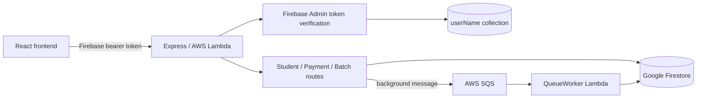
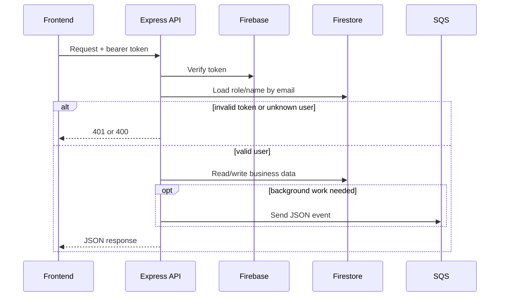

# Backend and API guide

## What this service is

This is an Express API deployed to AWS Lambda. It verifies Firebase users, reads and writes Google Firestore, and sends longer-running work to an AWS SQS queue. AWS invokes `index.handler`; that small entry point wraps the reusable Express application in `src/app.js`.

## Architecture



The health check and Swagger pages are public. All `/api/*` routes pass through `verifyIdToken`. The middleware verifies the Firebase token, looks up the user's email in the `userName` collection, and attaches their `role` and `name` to the request. Payment and batch routers use `adminOnly`.

## Swagger / interactive API documentation

The Lambda must be exposed through API Gateway or a Lambda Function URL. After deployment, open:

- `<AWS_API_BASE_URL>/api-docs` for Swagger UI.
- `<AWS_API_BASE_URL>/api-docs.json` for the OpenAPI JSON document.

For example, if the frontend API base is `https://abc.execute-api.ap-south-1.amazonaws.com/production`, Swagger is `https://abc.execute-api.ap-south-1.amazonaws.com/production/api-docs`. If API Gateway maps a stage or custom-domain base path, keep that part in the URL. In Swagger, click **Authorize** and paste a Firebase ID token without the `Bearer` prefix. Swagger remembers it for the current browser session.

## Request lifecycle



## Endpoints

The application API prefix is `<AWS_API_BASE_URL>/api`. Every endpoint below requires a Firebase bearer token unless marked Public. “Admin” means the Firestore user record must have role `Admin`.

| Method | Path | Access | Purpose / important input |
|---|---|---|---|
| GET | `/health` | Public | Service health check (outside `/api`) |
| GET | `/login` | User | Return signed-in user's name |
| GET | `/permissions` | User | Return `isEditPermissions` |
| GET | `/home` | User | List students; header `x-status`: active, deactive, unapproval |
| POST | `/searchCode` | User | Check `studentCode` uniqueness |
| GET | `/latestCode` | User | Latest active and approval codes |
| POST | `/create` | User | Create student; non-admin submissions await approval |
| POST | `/update` | Admin | Move students; header `x-update`, body `data` array |
| PUT | `/updateStudent` | User | Edit `updateForm`; non-admin is restricted to approval records |
| POST | `/studentAudit` | User | Audit history by `id` |
| POST | `/deleteStudent` | User | Delete by `id` and lifecycle `status` |
| POST | `/paymentsViews` | Admin | Eligible/unpaid students for `month` |
| POST | `/createPayments` | Admin | Queue payments: student IDs, amount, mode, month, date |
| GET | `/studentsDetails` | Admin | Active students for payment selection |
| POST | `/studentsPayments` | Admin | One student's payment history by `studentId` |
| POST | `/monthlyPayments` | Admin | Month view; `isGiven` 1 means paid, 0 unpaid |
| GET | `/totalPayments` | Admin | Latest 12 monthly totals |
| PUT | `/updateStudentPayment` | Admin | Update payment fields and queue total adjustment |
| POST | `/deleteStudentPayment` | Admin | Delete payment and queue total adjustment |
| GET | `/batches/all` | Admin | All batches with teacher names |
| GET | `/batches/students/:batchId` | Admin | Students in one batch |
| POST | `/batches/audit` | Admin | Batch audit by `batchId` |
| GET | `/batches/availableStudents` | Admin | Active students not in another batch |
| POST | `/batches/create` | Admin | Create batch (name, day, slot, teacher IDs) |
| PUT | `/batches/addStudent/:batchId` | Admin | Add student IDs; maximum batch size is 40 |
| POST | `/batches/students/delete` | Admin | Remove student from a batch by `id` |
| POST | `/batches/students/move` | Admin | Move `studentId` from one batch to another |
| POST | `/batchTeachers/create` | Admin | Create teacher by `teacherName` |
| GET | `/batchTeachers/all` | Admin | List teachers |
| POST | `/batchTeachers/audit` | Admin | Teacher audit by `teacherId` |
| POST | `/batchTeachers/delete` | Admin | Delete and unassign teacher |
| PUT | `/batchTeachers/update/:teacherId` | Admin | Rename teacher |

Swagger contains example JSON request bodies for all body-based endpoints.

## Data and asynchronous work

Firestore collection names live in `config/config.json`. Student records are separated into active, deactive, approval, and deleted collections. Payments are stored per student and also denormalized into monthly `given`/`notGiven` indexes and monthly total documents. Separate audit collections retain change history.

The API uses SQS for audit insertion, bulk payment creation, payment-total adjustments, and removing deactivated/deleted students from batches. If `SQS_QUEUE_URL` is absent, the API logs a warning and skips the message; the HTTP call may still succeed, so production monitoring should watch for this warning.

## Configuration and security

Required deployment configuration includes Firebase Admin credentials used by `src/credentials/firebaseCredentials.js`, `SQS_QUEUE_URL`, and an AWS region (`AWS_REGION_KEY`, `AWS_REGION`, or `AWS_DEFAULT_REGION`; default `ap-south-1`). AWS credentials normally come from the deployment/runtime role. Keep `.env` and service-account private keys out of source control.

CORS currently permits every origin and the `POST`, `GET`, and `PUT` methods. Restrict the origin to the deployed frontend if the API becomes publicly exposed beyond this application.

## Run and verify

```bash
npm install
npm start
node -e "require('./src/swagger'); console.log('OpenAPI loaded')"
npm audit
```

`npm start` loads `.env`, starts the API at `http://localhost:4000`, and exposes local Swagger at `http://localhost:4000/api-docs`. There is currently no automated backend test suite. `npm audit` reports existing dependency issues; review and upgrade deliberately rather than running a breaking `npm audit fix --force` without regression testing.

## AWS deployment

`.github/workflows/lambda_deployment.yaml` runs for pushes to `main` and `development`. It uses `npm ci --omit=dev`, checks the permanent `index.js` Lambda entry point and `src/app.js`, then packages only the runtime files (`index.js`, `src`, `config`, `node_modules`, and package manifests). It calls `aws lambda update-function-code` in `ap-south-1`. The `development` branch uses `DEVELOPMENT_LAMBDA_ARN`; `main` uses `PRODUCTION_LAMBDA_ARN`.

The workflow updates Lambda code only. It does not create API Gateway routes, a Lambda Function URL, environment variables, IAM roles, or SQS infrastructure. Those must already exist. Swagger becomes available after the workflow deploys and the existing public HTTP integration forwards `/api-docs` and `/api-docs.json` to this Lambda.
